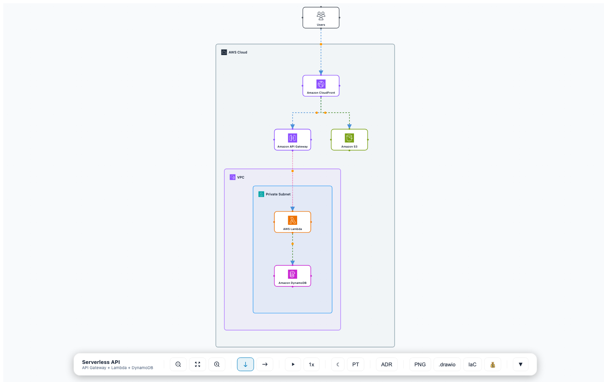

# AWS Architecture Diagram MCP

An [MCP](https://modelcontextprotocol.io/) server that turns a list of AWS
services and connections into a **self-contained, interactive architecture
diagram** — a single HTML file you can open in any browser or attach to an
email. No server, no internet, no build step for the consumer.

It also generates `.drawio` files and produces handoff payloads for the official
[AWS IaC MCP](https://github.com/awslabs/mcp) and AWS Pricing Calculator.



## Features

- **Interactive HTML diagram** (React Flow) — draggable nodes, animated edges,
  dark/light theme, PT/EN, TB/LR layout. Fully self-contained (icons inlined as
  base64), so it works from `file://` and as an email attachment.
- **Flow execution** — define ordered steps; play/pause, step through, and
  control speed (0.5x / 1x / 2x), with the active hop highlighted.
- **Architecture rationale** — attach **ADRs** (Architectural Decision Records,
  the AWS-adopted `context → decision → consequences` format) and **AWS
  Well-Architected** pillar notes. Shown in a Decisions panel and woven into the
  IaC handoff so the agent generates infra that honors the intent.
- **Typed connections** — mark edges as `network` / `iam` / `event` / `data`;
  each renders with a distinct color and dash style. Nodes carry a `role`
  describing what they do (shown on click).
- **Auto icon resolution** — 175+ AWS services mapped to official icons; the
  agent just passes a service name (`"Amazon RDS"`), no icon path needed.
- **PNG export** — one click, framed to fit, 2x resolution.
- **draw.io export** — download an editable `.drawio` of the on-screen diagram
  (native AWS4 shapes), straight from the HTML.
- **IaC handoff** — exports a structured spec + instruction so an agent can
  generate production IaC via the official AWS IaC MCP (no re-implementation).
- **Pricing handoff** — exports a payload for the AWS Pricing Calculator MCP.
- **draw.io output** — `auto_generate_diagram` writes a fully laid-out `.drawio`.

## AWS diagram guidelines

The output follows the official AWS architecture diagram guidance:
official icon set only, every node labeled, left-to-right / top-to-bottom flow,
2pt lines on shapes and arrows, an editable source (`.drawio`), and process
steps kept out of the canvas (shown in the flow panel/legend). For best results,
label nodes with the canonical service name from the
[AWS Offering Names Wiki](https://aws.amazon.com/architecture/icons/) on first
use, and re-download the icon set when AWS refreshes it (quarterly).

## Prerequisites

- Node.js 18+
- The [AWS Architecture Icons](https://aws.amazon.com/architecture/icons/)
  (downloaded separately — see below). They are **not** bundled due to their
  Terms of Use.

## Setup

```bash
git clone <this-repo>
cd aws-live-diagram-mcp
npm install

# Populate icons (one-time). Download the Asset Package zip from
# https://aws.amazon.com/architecture/icons/ then:
./scripts/fetch-icons.sh ~/Downloads/Asset-Package_*.zip
```

This downloads ~750 official icons (services + group containers) into
`assets/icons/`. A handful of niche services map to category SVGs under
`assets/aws-icons/` instead — drop your own SVGs there if you want custom icons.

Without icons the diagrams still render — nodes fall back to a category-colored
initial. With icons, each node shows its official AWS service icon.

To point at an icon directory elsewhere, set `AWS_DIAGRAM_ICON_ROOT` (it must
contain `icons/`, and optionally `aws-icons/` and `tech-icons/`).

## Register the MCP server

Add to your MCP client config (Claude Code / Kiro / Cursor):

```json
{
  "mcpServers": {
    "aws-architecture-diagram": {
      "command": "node",
      "args": ["/absolute/path/to/aws-architecture-diagram-mcp/mcp-server.js"]
    }
  }
}
```

## Tools

| Tool | Purpose |
|------|---------|
| `generate_html_diagram` | Interactive self-contained HTML diagram (the main one) |
| `auto_generate_diagram` | Fully auto-laid-out `.drawio` file |
| `generate_diagram` | `.drawio` with manual x/y positioning |
| `export_diagram` | Convert `.drawio` → PNG/SVG/PDF (needs `drawio` CLI) |
| `resolve_icon` | Resolve a service name to its icon filename (or list all) |
| `list_shapes` | AWS4 drawio shape names (for the `.drawio` path) |
| `list_service_configs` | IaC + pricing config fields per service |
| `export_pricing_json` | Extract a Pricing Calculator payload from a diagram |

### Example: `generate_html_diagram`

```jsonc
{
  "title": "My App",
  "subtitle": "Serverless API",
  "outputPath": "/tmp/my-app.html",
  "services": [
    { "id": "api", "service": "Amazon API Gateway", "shape": "api_gateway", "category": "networking" },
    { "id": "fn",  "service": "AWS Lambda",         "shape": "lambda",      "category": "compute", "subnet": "private" },
    { "id": "db",  "service": "Amazon DynamoDB",    "shape": "dynamodb",    "category": "database", "subnet": "private" }
  ],
  "connections": [
    { "id": "e1", "source": "api", "target": "fn", "label": "Invoke" },
    { "id": "e2", "source": "fn",  "target": "db", "label": "Query" }
  ]
}
```

`icon` is optional — it's auto-resolved from the service name. Mark services
with `external: true` (e.g. third-party APIs) to place them outside the AWS
Cloud boundary; use `subnet: "public" | "private"` for VPC placement.

## Development

```bash
npm run build:standalone   # rebuild dist/index.html (the HTML template)
node mcp-server.js          # run the MCP server over stdio
```

The standalone app lives in `standalone/` + `src/`; the MCP server and Node-side
generators live in `mcp-server.js` + `lib/`. `lib/html-generator.js` injects the
diagram data and base64-inlined icons into the built `dist/index.html`.

## License

Licensed under MIT-0. See [LICENSE](LICENSE). The AWS Architecture Icons are
subject to their own [Terms of Use](https://aws.amazon.com/architecture/icons/)
and are not distributed with this project.
