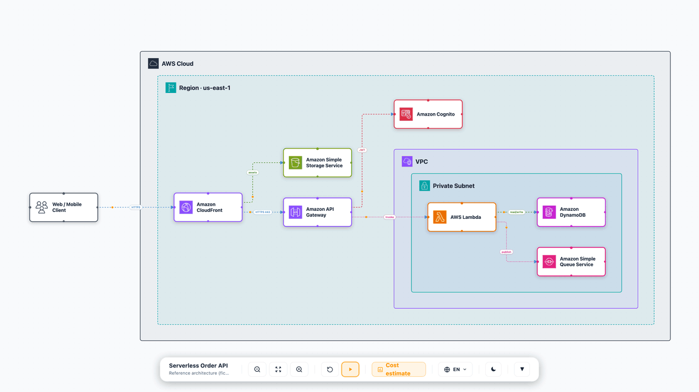
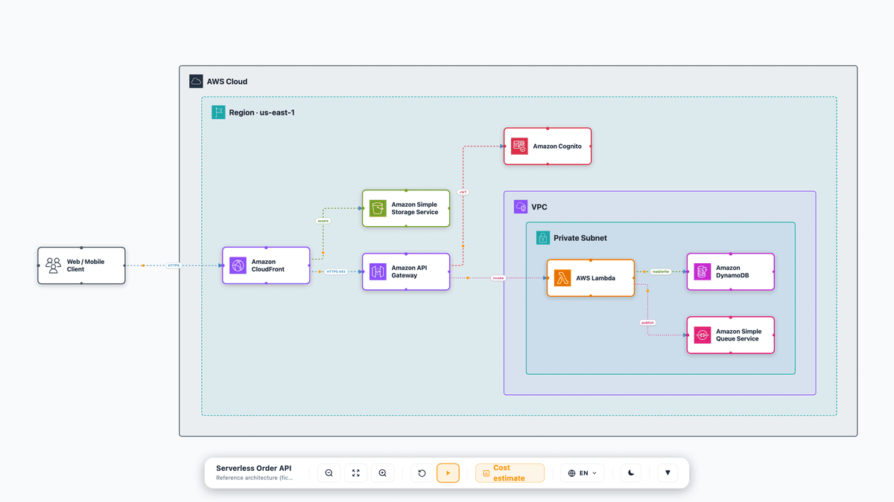

# AWS Architecture Diagram MCP

An [MCP](https://modelcontextprotocol.io/) server that turns a list of AWS
services and connections into a **self-contained, interactive architecture
diagram** — a single HTML file you can open in any browser or attach to an
email. No server, no internet, no build step for the consumer.

It also generates `.drawio` files and exports the diagram's elements as neutral
JSON — a machine-readable handoff (sidecar `.json` + `export_diagram_json`) that
downstream apps consume: the official [AWS IaC MCP](https://github.com/awslabs/mcp)
for infrastructure, or a cost app such as `aws-cost-app-mcp` (a separate MCP) to
price it. This server draws the diagram; it does not price or deploy.


Guided walkthrough — step through the architecture beat by beat, with the camera
framing each stage and an overlay card explaining the WHY:


The same self-contained HTML is fully interactive — switch language, collapse
containers, and flip the theme, all offline:

| Language switch (any language) | Collapsible containers | Light / dark theme |
|:---:|:---:|:---:|
|  |  |  |

> **Disclaimer:** Provided for illustration and documentation purposes, "as is"
> without warranty. The diagrams and any IaC or pricing it helps produce are
> starting points — review, test, and harden them (security, cost, and
> Well-Architected best practices) before using anything in production.

## Features

- **Interactive HTML diagram** (React Flow) — draggable nodes, animated edges,
  dark/light theme, any-language switch, LR/TB layout. Fully self-contained (icons
  inlined as base64), so it works from `file://` and as an email attachment.
- **Guided walkthrough** — define ordered *beats*; arrow keys or the dock's play
  button step through them. Each beat shows an overlay card (title, rich-markdown
  body, bullets, status chips, code snippets) whose position you pick per beat via
  `cardSide` (`right` default, `left`, `top`, or `full` centered modal), and tints —
  and optionally zooms (`stepZoom`) or isolates (`stepFocus`) — a subset of the diagram.
  Effects are opt-in per diagram, so a single HTML file both *is* the diagram and
  *narrates* it. See [Guided walkthrough](#guided-walkthrough) for all knobs.
- **Any language** — pass `languages: ['en','ja','fr', …]` and author any text field
  as a `{ en, ja, … }` map; the toolbar shows a language dropdown and the whole diagram
  (labels, roles, walkthrough) re-renders in place. Not limited to EN/PT — localize
  the UI chrome for any language with `uiStrings` + `langLabels`.
- **Multi-tab documents** — pass `sequence` (or an explicit `tabs[]`) and the same
  single HTML file becomes a small document with a tab rail: the architecture canvas,
  an **animated UML sequence diagram** (play/step/keyboard, `alt`/`opt`/`loop`
  fragments, notes, gate badges, autonumber), and free-form `doc` tabs (sections,
  bullets, code). Tabs deep-link via the URL hash. See
  [Multi-tab documents](#multi-tab-documents-sequence--doc-tabs).
- **Collapsible containers** — every group header has a fold toggle; collapse a VPC
  or account to a small box and the layout re-flows (start dense diagrams pre-collapsed
  with `defaultCollapsed`).
- **Typed connections** — mark edges as `network` / `iam` / `event` / `data`;
  each renders with a distinct color and dash style. Nodes carry a `role`
  describing what they do (shown on click).
- **Auto icon resolution** — 350+ AWS services mapped to official icons; the
  agent just passes a service name (`"Amazon RDS"`), no icon path needed.
- **`.drawio` output** — `auto_generate_diagram` writes a fully laid-out, editable
  `.drawio` file (native AWS4 shapes) using the same ELK compound engine as the
  HTML, so it supports arbitrary group nesting and typed connections too;
  `export_diagram` converts it to PNG/SVG/PDF (needs the `drawio` CLI).
- **IaC handoff** — exports a structured spec + instruction so an agent can
  generate production IaC via the official AWS IaC MCP (no re-implementation).
- **Elements JSON handoff** — every generated diagram writes a sidecar `.json`
  next to the HTML, and `export_diagram_json` extracts the same neutral payload
  (`title`, `services[]`, `connections[]`, `groups[]`, per-node `config`) from an
  existing file. This is the contract a downstream cost app (e.g. `aws-cost-app-mcp`)
  or inventory/docs tool consumes. This server makes no pricing calls itself.

## AWS diagram guidelines

The output follows the official AWS architecture diagram guidance:
official icon set only, every node labeled, left-to-right / top-to-bottom flow,
and an editable source (`.drawio`). Process narration is kept off the canvas —
it lives in the guided-walkthrough overlay cards, not as clutter on the diagram.
For best results, label nodes with the canonical service name from the
[AWS Architecture Icons](https://aws.amazon.com/architecture/icons/) set on first
use, and re-download the icon set when AWS refreshes it (quarterly).

## Prerequisites

- Node.js 18+
- The [AWS Architecture Icons](https://aws.amazon.com/architecture/icons/)
  (downloaded separately — see below). They are **not** bundled due to their
  Terms of Use.

## Setup

```bash
git clone <this-repo>
cd sample-architecture-diagram-mcp-server
npm install

# Populate icons (one-time). Download the Asset Package zip from
# https://aws.amazon.com/architecture/icons/ then:
./scripts/fetch-icons.sh ~/Downloads/Asset-Package_*.zip
```

This downloads ~810 official icons (services + group containers) into
`assets/icons/`. A handful of niche services map to category SVGs under
`assets/aws-icons/` instead — drop your own SVGs there if you want custom icons.

Without icons the diagrams still render — nodes fall back to a category-colored
initial. With icons, each node shows its official AWS service icon.

To point at an icon directory elsewhere, set `AWS_DIAGRAM_ICON_ROOT` (it must
contain `icons/`, and optionally `aws-icons/` and `tech-icons/`).

## Register the MCP server

Clone this repo, run `npm install`, then point your MCP client at
`mcp-server.js` with an absolute path:

```json
{
  "mcpServers": {
    "aws-architecture-diagram": {
      "command": "node",
      "args": ["/absolute/path/to/sample-architecture-diagram-mcp-server/mcp-server.js"]
    }
  }
}
```

> Icons are not bundled (AWS Terms of Use). On first run without them, diagrams
> render category-colored initials; add them by running
> `./scripts/fetch-icons.sh <Asset-Package.zip>` (download from
> https://aws.amazon.com/architecture/icons/), or set `AWS_DIAGRAM_ICON_ROOT`
> to a folder containing `icons/`.

## Tools

| Tool | Purpose |
|------|---------|
| `generate_html_diagram` | Interactive self-contained HTML diagram in one call (the main one) |
| `diagram_create` | Start an incremental draft; returns a `draftId` |
| `diagram_add_services` | Append services (nodes) to a draft |
| `diagram_add_connections` | Append connections (edges) to a draft |
| `diagram_add_groups` | Append container groups to a draft |
| `diagram_add_steps` | Append guided-walkthrough beats to a draft |
| `diagram_add_sequence` | Add an animated UML sequence diagram as a second tab of a draft |
| `diagram_add_doc_tab` | Add a prose tab (sections / bullets / code) to a draft |
| `diagram_render` | Render an incremental draft to a self-contained HTML file |
| `auto_generate_diagram` | Fully auto-laid-out `.drawio` file |
| `generate_diagram` | `.drawio` with manual x/y positioning |
| `export_diagram` | Convert `.drawio` → PNG/SVG/PDF (needs `drawio` CLI) |
| `resolve_icon` | Resolve a service name to its icon filename (or list all) |
| `list_shapes` | AWS4 drawio shape names (for the `.drawio` path) |
| `list_service_configs` | IaC config fields per service |
| `export_iac_json` | Extract an AWS IaC MCP handoff payload (resources + dependencies) from a diagram |
| `export_diagram_json` | Extract the diagram's elements as neutral JSON (title, services, connections, groups) for downstream apps |

For a diagram built up in stages (e.g. as an agent reasons through an
architecture), use the **incremental builder**: `diagram_create` →
`diagram_add_*` (in any order) → `diagram_render`. For a single-shot build, use
`generate_html_diagram`. Both speak the exact same service/connection/group/step
shape.

### Example: `generate_html_diagram`

```jsonc
{
  "title": "My App",
  "subtitle": "Serverless API",
  "outputPath": "/tmp/my-app.html",
  "services": [
    { "id": "api", "service": "Amazon API Gateway", "shape": "api_gateway", "category": "networking",
      "role": "REST front door — routing, throttling, request validation" },
    { "id": "fn",  "service": "AWS Lambda", "shape": "lambda", "category": "compute", "subnet": "private",
      "role": "Handles CRUD operations", "config": { "iac": { "runtime": "nodejs22.x" } } },
    { "id": "db",  "service": "Amazon DynamoDB", "shape": "dynamodb", "category": "database", "subnet": "private",
      "role": "Primary store — single-digit-ms reads", "config": { "pricing": { "writeUnits": 100 } } }
  ],
  "connections": [
    { "id": "e1", "source": "api", "target": "fn", "type": "event", "label": "Invoke" },
    { "id": "e2", "source": "fn",  "target": "db", "type": "data",  "label": "Query" }
  ],
  "steps": [
    { "eyebrow": "1 · Compute + data", "title": "Process & persist",
      "body": "**Lambda** validates the request and writes to **DynamoDB**.",
      "nodes": ["fn", "db"], "zoom": ["fn", "db"], "badge": false }
  ],
  "stepZoom": true
}
```

Each service needs `id`, `service`, `shape`, and `category`. Everything below is optional.

**Per service:**

- **`icon`** — auto-resolved from the service name (350+ mapped); pass it only to override
  (e.g. for a non-AWS component: `"icon": "tech-icons/whatsapp.svg"`).
- **`label`** — friendly display name shown under the icon; keep `service` a clean,
  icon-resolvable AWS name and put the custom name here.
- **`role`** — what the component does (the WHY); shown when the node is clicked.
- **`subnet: "public" | "private"`** — single-VPC placement shortcut. For arbitrary
  topologies use top-level `groups` + `parentId` (see [Containers & nesting](#containers--nesting)).
- **`external: true`** (+ **`isApi`**) — place a third-party/on-prem actor outside the AWS Cloud boundary.
- **`pill` / `pillOverlay`** — a short qualifier badge on the node (e.g. `"On-premises"`, `"GPU"`).
- **`config.iac` / `config.pricing`** — key/value rows shown in the node's detail modal and
  carried into the elements JSON handoff (e.g. `{ "iac": { "runtime": "nodejs22.x" } }`);
  a downstream cost/IaC app reads them from there.

**Per connection:**

- **`type`** — `network` / `iam` / `event` / `data`, each styled distinctly.
- **`label`** — a short pill on the edge (e.g. `"HTTPS 443"`).
- **`bidirectional`** — arrowheads at both ends (sync replication, peering, request/response).
- **`dashed`** — force a dashed line.

**Per diagram:**

- **`steps` (+ `stepZoom` / `stepFocus`)** — guided walkthrough beats (see [Guided walkthrough](#guided-walkthrough)).
- **`languages` + `lang`** (+ **`uiStrings`** / **`langLabels`**) — offer a toolbar language
  switch; any text field may then be a `{ en, ja, … }` map instead of a plain string.
- **`collapsible` / `defaultCollapsed`** — fold/expand containers.
- **`direction`** — `LR` (default) or `TB` layout flow.

## Guided walkthrough

Pass a `steps` array to turn a static diagram into a narrated tour. Each *beat* is
an object; the viewer advances with the arrow keys or the dock's play button.

**Card position** — `cardSide` per beat controls where the overlay card sits:

| `cardSide` | Where the card renders |
|---|---|
| `right` (default) | Docked to the right of the canvas |
| `left` | Docked to the left |
| `top` | Flows above the canvas |
| `full` | Centered full-page modal over a dimmed backdrop — ideal for an intro/overview beat |

**Effects** — opt-in, set once on the diagram (not per beat):

| Field | Default | Effect |
|---|---|---|
| `stepZoom` | `false` | Glide the camera onto each beat's `zoom` (or its `nodes`) |
| `stepFocus` | `false` | Hide non-active nodes each beat (isolate) instead of just dimming them |
| `flowDots` | `true` | Animate a dot travelling along each edge; set `false` for a static, print-friendly look |

**Per-beat highlighting** — `nodes` / `edges` / `groups` (ids to tint), `zoom`
(ids to frame, needs `stepZoom`), `maxZoom`, and `tone` / `color` for the accent.
Card content: `eyebrow`, `title`, `body` (markdown), `bullets`, `chips`, `code`,
`process`, `sections`.

```jsonc
"stepZoom": true,
"steps": [
  { "cardSide": "full", "eyebrow": "Overview", "title": "Serverless API",
    "body": "Edge → auth → compute → storage.", "badge": false },
  { "cardSide": "right", "eyebrow": "1 · Compute", "title": "Process & persist",
    "body": "**Lambda** writes to **DynamoDB**.",
    "nodes": ["fn", "db"], "zoom": ["fn", "db"], "badge": false }
]
```

## Multi-tab documents (sequence + doc tabs)

A diagram is often only half the story: the other half is *the order in which
things happen*. Pass a `sequence` and the generated HTML grows a tab rail —
**Architecture** (the canvas, unchanged) plus **Sequence** (an animated UML
sequence diagram) — in the same self-contained file.

```jsonc
"sequence": {
  "title": { "en": "Account vend", "pt": "Vending da conta" },
  "autonumber": true,
  "participants": [
    { "id": "dev", "label": "Developer", "kind": "actor" },
    { "id": "hub", "label": "Developer Hub", "icon": "tech-icons/rhdh.svg" },
    { "id": "sfn", "label": "Step Functions", "service": "AWS Step Functions" }
  ],
  "events": [
    { "from": "dev", "to": "hub", "label": "fill the **template** form" },
    { "kind": "fragment", "fragment": "alt", "condition": "dryRun = false",
      "over": ["hub", "sfn"] },
    { "from": "hub", "to": "sfn", "label": "start execution", "tone": "ok" },
    { "kind": "else", "condition": "dryRun = true" },
    { "from": "hub", "to": "dev", "label": "render HCL only", "dashed": true },
    { "kind": "end" },
    { "kind": "note", "over": ["hub", "sfn"], "label": "keyless (IRSA → STS)" }
  ]
}
```

- **Participants** get an icon automatically from `service` (any AWS name), or an
  explicit `icon` (`tech-icons/vault.svg`); `kind: "actor"` renders a stick-figure
  glyph. `pill` adds a small uppercase tag, `\n` in `label` wraps to two lines.
- **Events**: `message` (default — `dashed` for a reply, `async` for an open
  arrowhead, `tone` for the accent color, `gate: true` for a GATE badge),
  `note` (`over: [a, b]`), and the fragment trio `fragment` / `else` / `end`
  (`alt`, `opt`, `loop`, `par`, `critical` with a `condition`).
- The view **animates**: play/pause, step, ←/→/space, a speed toggle and
  "show all". Each beat reveals one message and captions it below.
- For full control pass `tabs[]` instead, mixing `kind: "architecture"`,
  `"sequence"` and `"doc"` (prose `sections[]` with `title`, `body`, `bullets`,
  `code`). Labels default per kind (Architecture / Arquitetura / …); `slug` sets
  the URL hash so a tab is linkable.
- Incrementally, the draft tools do the same: `diagram_add_sequence` and
  `diagram_add_doc_tab` before `diagram_render`.

With fewer than two tabs nothing changes — the output stays the classic
single-canvas diagram.

## Development

```bash
npm run build:core         # build the shared @aws-live-diagram/core render package
npm run build:standalone   # rebuild dist/index.html (the HTML template)
npm test                    # run the vitest unit suite
node mcp-server.js          # run the MCP server over stdio
```

The repo is an npm workspace. The React render layer (nodes, edges, group
containers, walkthrough cards, layout engine) lives in
`packages/diagram-core` (`@aws-live-diagram/core`) and is shared by the standalone
app in `standalone/` + `src/`. The MCP server and Node-side generators live in
`mcp-server.js` + `lib/`; `lib/schemas.js` is the single source of truth for the
input shape (imported by both the tools and the local example generators).
`lib/html-generator.js` injects the diagram data and base64-inlined icons into
the built `dist/index.html`. Tests (`test/`) cover the pure generators — icon
resolution, IaC handoff, draw.io XML, and service-config integrity.

## Containers & nesting

Declare arbitrary containers via the top-level `groups` array — any depth, any
topology. Each group has an `id`, `label`, optional `parent` (for nesting), and
a `variant` that maps to an official AWS group icon + color:

`aws-cloud`, `region`, `vpc`, `public-subnet`, `private-subnet`,
`availability-zone`, `account`, `organization`, `auto-scaling-group`, `group`
(generic logical), `corporate-data-center`, `on-premises`.

Services join a group via `parentId`. This models multi-VPC, multi-account,
multi-AZ, and hybrid (on-prem ↔ AWS) architectures. If you omit `groups`, a
single `AWS Cloud → VPC → public/private subnet` tree is derived automatically
from each service's `subnet` field (the common single-VPC case).

Both output paths share one layout engine (ELK compound), so the **`.drawio`
path (`auto_generate_diagram`) supports the same 12 container variants, arbitrary
nesting, and typed connections** as the interactive HTML — the two stay visually
consistent.

```jsonc
"groups": [
  { "id": "prod", "label": "Prod Account", "variant": "account" },
  { "id": "vpcA", "label": "VPC A", "parent": "prod", "variant": "vpc" },
  { "id": "subA", "label": "Private Subnet", "parent": "vpcA", "variant": "private-subnet" }
],
"services": [ { "id": "fn", "service": "AWS Lambda", "category": "compute", "parentId": "subA" } ]
```

Remaining limit: services
without a mapped icon render as a category-colored initial (300+ services mapped;
run `resolve_icon` to check coverage).

## License

Licensed under MIT-0. See [LICENSE](LICENSE). Third-party dependency notices and
attributions (including `elkjs`, under EPL-2.0) are in [THIRD-PARTY-LICENSES](THIRD-PARTY-LICENSES).
The AWS Architecture Icons are subject to their own
[Terms of Use](https://aws.amazon.com/architecture/icons/) and are not
distributed with this project.
